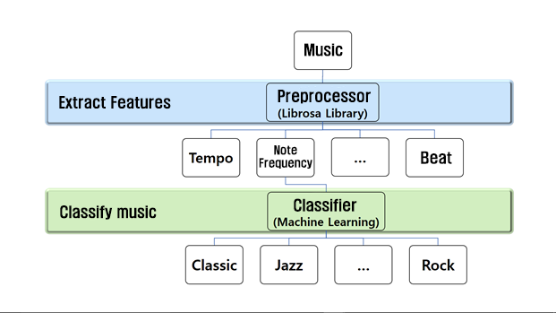

# Music Genre Classification

## About this project
This is a Capston design project with my teammates in 2017. The goal of this project was summation of 4 years of University studies.
The idea started from what is based on when we wanted to classify music genres.
We hope that this project will help to find the music genre efficiently.

## Prerequisite
To run whole project, you should need python3.6(or higher version), following libraries and packages.
* **ffmpeg**
* **librosa** - Extract music features 
* **pandas**
* **numpy**
* **os**
* **joblib** - Save required data
* **sklearn** - machine learning algorithm

## Training Data
You can download my training data set from [here](https://drive.google.com/open?id=1_ToCRL_EVR6LGIzJA1jcfJLvr-_nvMNV)(1.11GB)
The training data set is consist with mp3 files.

The genre of classification is as follows.
* **Classic**           - 0.mp3 ~ 19.mp3
* **Hip-Hop**           - 20.mp3 ~ 39.mp3
* **Raggae**            - 40.mp3 ~ 59.mp3
* **Blues**             - 60.mp3 ~ 79.mp3
* **Alternative rock**  - 80.mp3 ~ 99.mp3
* **Heavy metal**       - 100.mp3 ~ 119.mp3
* **House**             - 120.mp3 ~ 139.mp3
* **Jazz**              - 140.mp3 ~ 159.mp3
* **Folk**              - 160.mp3 ~ 179.mp3
* **Country**           - 180.mp3 ~ 199.mp3

# Project structure
* code
    * modules
        * __init__.py
        * AddData.py
        * Classifier.py
        * CreateTable.py
        * Extract_Feature.py
        * Load_Music_Data.py
        * TableIloc.py
        * ChoiceCandidate.py
        * Climax.py
        * DeleteCandidate.py
        * SortCandidate.py
        * TableRename.py
    * __init__.py
    * main.py
    * Data_Training.py
* Music
    * wav
* Trained_Data_set
    * pca_data.joblib
    * sc_data.joblib
    * svm_data.joblib
    * trained_data.joblib

## How this Project work

